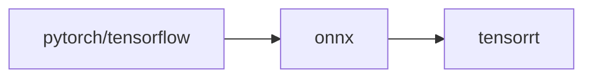
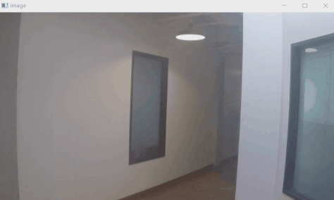
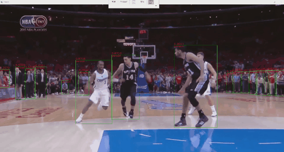
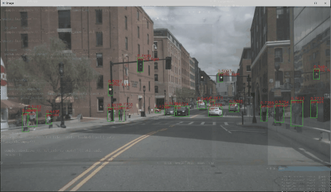
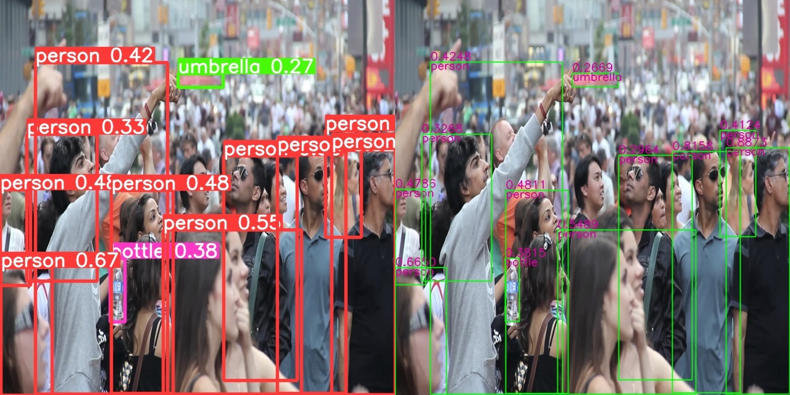

# TensorRT-Alpha
<div align="center">

  [English](../README.md) | 简体中文
  <br>
  </div>

## 介绍
本仓库提供深度学习CV领域模型加速部署案例，主流模型前处理、后处理提供cuda加速方法。大部分模型转换流程为：torch->onnx->tensorrt。获取onnx文件以下有两种方式：

- 本仓库提供的网盘直接下载onnx；
- 按照本仓库提供的指令，手动从相关源代码框架导出onnx。


## 安装
适用平台：windows、linux
- cuda11.6
- cudnn8.4
- tensorrt8.4.2.4
- opencv3.x

python环境（可选）：
```bash
# 需要安装miniconda
conda create -n tensorrt-alpha python==3.8 -y
conda activate tensorrt-alpha
git clone https://github.com/FeiYull/tensorrt-alpha
cd tensorrt-alpha
pip install -r requirements.txt  # 安装
```
## 运行
### linux
设置 TensorRT_ROOT 路径:
```bash
cd tensorrt-alpha/cmake
vim common.cmake
# 在第20行设置tensorrt的安装路径, 例如:
# set(TensorRT_ROOT /root/TensorRT-8.4.2.4)
```
开始构建工程:
例如：[yolov5](../yolov5/readme.txt)

### windows
等待更新

## 模型
目前已实现30多个主流模型，部分整理好的onnx文件如下列表：
<div align='center'>

| model |weiyun |google driver |
 :-: | :-: | :-: |
|yolov3    | [weiyun](https://share.weiyun.com/3T3mZKBm)| [google driver](https://drive.google.com/drive/folders/1-8phZHkx_Z274UVqgw6Ma-6u5AKmqCOv?usp=sharing)|      
|yolov4    | [weiyun](https://share.weiyun.com/3T3mZKBm)| [google driver](https://drive.google.com/drive/folders/1-8phZHkx_Z274UVqgw6Ma-6u5AKmqCOv?usp=sharing)|
|yolov5    | [weiyun](https://share.weiyun.com/3T3mZKBm)| [google driver](https://drive.google.com/drive/folders/1-8phZHkx_Z274UVqgw6Ma-6u5AKmqCOv?usp=sharing)|     
|yolov6    | [weiyun](https://share.weiyun.com/3T3mZKBm)| [google driver](https://drive.google.com/drive/folders/1-8phZHkx_Z274UVqgw6Ma-6u5AKmqCOv?usp=sharing)|     
|yolov7    | [weiyun](https://share.weiyun.com/3T3mZKBm)| [google driver](https://drive.google.com/drive/folders/1-8phZHkx_Z274UVqgw6Ma-6u5AKmqCOv?usp=sharing)|     
|yolov8    | [weiyun](https://share.weiyun.com/3T3mZKBm)| [google driver](https://drive.google.com/drive/folders/1-8phZHkx_Z274UVqgw6Ma-6u5AKmqCOv?usp=sharing)|     
|yolox     | [weiyun](https://share.weiyun.com/3T3mZKBm)| [google driver](https://drive.google.com/drive/folders/1-8phZHkx_Z274UVqgw6Ma-6u5AKmqCOv?usp=sharing)|     
|yolor     | [weiyun](https://share.weiyun.com/3T3mZKBm)| [google driver](https://drive.google.com/drive/folders/1-8phZHkx_Z274UVqgw6Ma-6u5AKmqCOv?usp=sharing)|     
|u2net     | [weiyun](https://share.weiyun.com/3T3mZKBm)| [google driver](https://drive.google.com/drive/folders/1-8phZHkx_Z274UVqgw6Ma-6u5AKmqCOv?usp=sharing)|     
|libfacedet  | [weiyun](https://share.weiyun.com/3T3mZKBm)| [google driver](https://drive.google.com/drive/folders/1-8phZHkx_Z274UVqgw6Ma-6u5AKmqCOv?usp=sharing)|     
|facemesh   | [weiyun](https://share.weiyun.com/3T3mZKBm)| [google driver](https://drive.google.com/drive/folders/1-8phZHkx_Z274UVqgw6Ma-6u5AKmqCOv?usp=sharing)|     
|more...(🚀: I will be back soon!)    |      |          |
</div>  

## Update
- 2023.01.01  🔥 更新 yolov3, yolov4, yolov5, yolov6
- 2023.01.04  🍅 更新 yolov7, yolox, yolor
- 2023.01.05  🎉 更新 u2net, libfacedetction
- 2023.01.08  🚀 全网最快支持基于CUDA +TensorRT的yolov8框架

## 效果
<div align='center'>
  
  
  <br>
  
  
  <br>
  
  
</div> 

some precision alignment renderings comparison:<br>
<div align='center'>			<!--块级封装-->
     <center>	<!--将图片和文字居中-->
    
    <br>		<!--换行-->
    <center>yolov8n : Offical( left ) vs Ours( right )	<!--标题--></center>
    <br>		<!--换行-->
    <br>		<!--换行-->
    <center>	<!--将图片和文字居中-->
    
    <br>		<!--换行-->
    yolov7-tiny : Offical( left ) vs Ours( right )	<!--标题-->
    <br>		<!--换行-->
    <br>		<!--换行-->
    
    <br>		<!--换行-->
    yolov5s : Offical( left ) vs Ours( right )	<!--标题-->
    <br>		<!--换行-->
    <br>		<!--换行-->
    
    <br>		<!--换行-->
    libfacedetction : Offical( left ) vs Ours( right topK:4000)	<!--标题-->
    <br>		<!--换行-->
    <br>		<!--换行-->
    </center>
</div>

## 参考
[0].https://github.com/NVIDIA/TensorRT<br>
[1].https://github.com/onnx/onnx-tensorrt<br>
[2].https://github.com/NVIDIA-AI-IOT/torch2trt<br>
[3].https://github.com/shouxieai/tensorRT_Pro<br>
[4].https://github.com/opencv/opencv_zoo<br>
