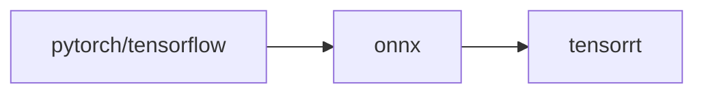

# TensorRT-Alpha
<div align="center">

  English | [简体中文](README_cn.md)
  <br>
  </div>

## Introduce
This repository  provides accelerated deployment cases of deep learning CV   popular models, and cuda accelerated methods for pre-processing and post-processing of mainstream models. Most of the model transformation process is torch->onnx->tensorrt. There are two ways to obtain onnx files:
- According to the network disk provided by this  repository, download ONNX directly
- Follow the instructions provided in this repository to manually export ONNX from the relevant source code framework.



## Update
- 2023.01.01  🔥 update yolov3, yolov4, yolov5, yolov6
- 2023.01.04  🍅 update yolov7, yolox, yolor
- 2023.01.05  🎉 update u2net, libfacedetction
- 2023.01.08  🚀 The whole network is the first to support yolov8

## Installation
Compatible platforms: windows、linux
- cuda11.6
- cudnn8.4
- tensorrt8.4.2.4
- opencv3.x

python dependent environment(optional）：
```bash
# install miniconda first
conda create -n tensorrt-alpha python==3.8 -y
conda activate tensorrt-alpha
git clone https://github.com/FeiYull/tensorrt-alpha
cd tensorrt-alpha
pip install -r requirements.txt  
```
## Run

### linux
set your TensorRT_ROOT path:
```bash
cd tensorrt-alpha/cmake
vim common.cmake
# set var TensorRT_ROOT to your path in line 20, eg:
# set(TensorRT_ROOT /root/TensorRT-8.4.2.4)
```
start to build project:
For example:[yolov7](yolov7/readme.txt)

### windows
waiting for update

## Onnx
At present, more than 30  models have been implemented, and some onnx files of them are organized as follows:

<div align='center'>

| model |weiyun |google driver |
 :-: | :-: | :-: |
|[yolov3](yolov3/README.md)| [weiyun](https://share.weiyun.com/3T3mZKBm)| [google driver](https://drive.google.com/drive/folders/1-8phZHkx_Z274UVqgw6Ma-6u5AKmqCOv?usp=sharing)|      
|[yolov4](yolov4/README.md)| [weiyun](https://share.weiyun.com/3T3mZKBm)| [google driver](https://drive.google.com/drive/folders/1-8phZHkx_Z274UVqgw6Ma-6u5AKmqCOv?usp=sharing)|
|[yolov5](yolov5/README.md)| [weiyun](https://share.weiyun.com/3T3mZKBm)| [google driver](https://drive.google.com/drive/folders/1-8phZHkx_Z274UVqgw6Ma-6u5AKmqCOv?usp=sharing)|     
|[yolov6](yolov6/README.md)| [weiyun](https://share.weiyun.com/3T3mZKBm)| [google driver](https://drive.google.com/drive/folders/1-8phZHkx_Z274UVqgw6Ma-6u5AKmqCOv?usp=sharing)|     
|[yolov7](yolov7/README.md)| [weiyun](https://share.weiyun.com/3T3mZKBm)| [google driver](https://drive.google.com/drive/folders/1-8phZHkx_Z274UVqgw6Ma-6u5AKmqCOv?usp=sharing)|     
|[yolov8](yolov8/README.md)| [weiyun](https://share.weiyun.com/3T3mZKBm)| [google driver](https://drive.google.com/drive/folders/1-8phZHkx_Z274UVqgw6Ma-6u5AKmqCOv?usp=sharing)|     
|[yolox](yolox/README.md)| [weiyun](https://share.weiyun.com/3T3mZKBm)| [google driver](https://drive.google.com/drive/folders/1-8phZHkx_Z274UVqgw6Ma-6u5AKmqCOv?usp=sharing)|     
|[yolor](yolor/README.md)| [weiyun](https://share.weiyun.com/3T3mZKBm)| [google driver](https://drive.google.com/drive/folders/1-8phZHkx_Z274UVqgw6Ma-6u5AKmqCOv?usp=sharing)|     
|[u2net](u2net/README.md)| [weiyun](https://share.weiyun.com/3T3mZKBm)| [google driver](https://drive.google.com/drive/folders/1-8phZHkx_Z274UVqgw6Ma-6u5AKmqCOv?usp=sharing)|     
|[libfacedet](libfacedetection/README.md)| [weiyun](https://share.weiyun.com/3T3mZKBm)| [google driver](https://drive.google.com/drive/folders/1-8phZHkx_Z274UVqgw6Ma-6u5AKmqCOv?usp=sharing)|     
|[facemesh](facemesh/README.md)| [weiyun](https://share.weiyun.com/3T3mZKBm)| [google driver](https://drive.google.com/drive/folders/1-8phZHkx_Z274UVqgw6Ma-6u5AKmqCOv?usp=sharing)|     
|more...(🚀: I will be back soon!)    |      |          |
</div>  

## Visualization
<div align='center'>
  
  
  
  <br>
  
  
  
  <br>
</div>  


some precision alignment renderings comparison:<br>
<div align='center'>			<!--块级封装-->
     <center>	<!--将图片和文字居中-->
    
    <br>		<!--换行-->
    <center>yolov8n : Offical( left ) vs Ours( right )	<!--标题--></center>
    <br>		<!--换行-->
    <br>		<!--换行-->
    <center>	<!--将图片和文字居中-->
    
    <br>		<!--换行-->
    <center>yolov7-tiny : Offical( left ) vs Ours( right )	<!--标题--></center>
    <br>		<!--换行-->
    <br>		<!--换行-->
    
    <br>		<!--换行-->
    <center>yolov5s : Offical( left ) vs Ours( right )	<!--标题--></center>
    <br>		<!--换行-->
    <br>		<!--换行-->
    
    <br>		<!--换行-->
    <center>libfacedetction : Offical( left ) vs Ours( right topK:4000)	<!--标题--></center>
    <br>		<!--换行-->
    <br>		<!--换行-->
    </center>
</div>


## Reference
[0].https://github.com/NVIDIA/TensorRT<br>
[1].https://github.com/onnx/onnx-tensorrt<br>
[2].https://github.com/NVIDIA-AI-IOT/torch2trt<br>
[3].https://github.com/shouxieai/tensorRT_Pro<br>
[4].https://github.com/opencv/opencv_zoo<br>
