# TensorRT-Alpha
<div align="center">

  [](https://developer.nvidia.com/cuda-toolkit-archive)
  [](https://developer.nvidia.com/nvidia-tensorrt-8x-download)
  [](https://releases.ubuntu.com/18.04/)
  [](https://www.microsoft.com/)

  [English](README_en.md) | 简体中文<br>

  <br>
  </div>

## 可视化
<div align='center'>
  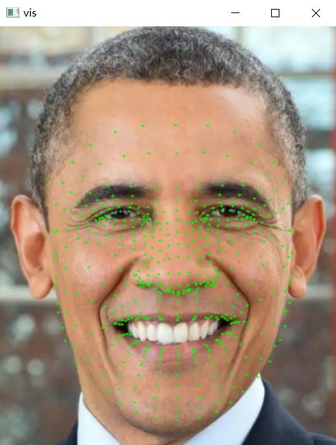
  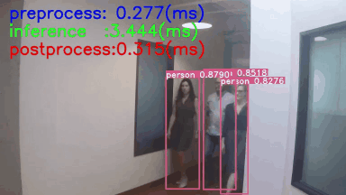
  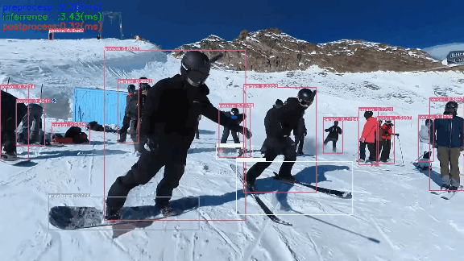
  <br>
  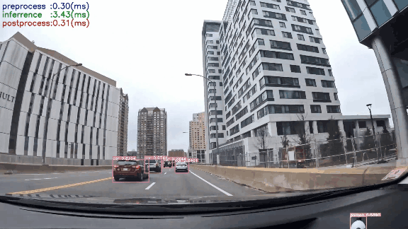
  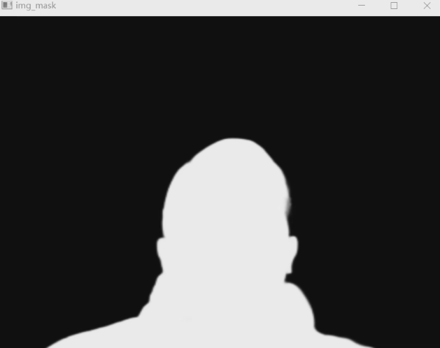
  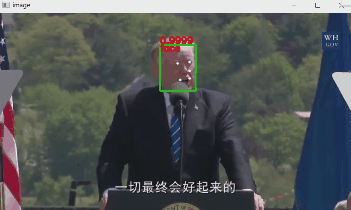
  <br>
</div>

## 介绍
本仓库提供深度学习CV领域模型加速部署案例，仓库实现的cuda c支持多batch图像预处理、推理、decode、NMS。大部分模型转换流程为：torch->onnx->tensorrt。
获取onnx文件以下有两种方式：<br>

<details>
<summary>pth -> trt</summary>
coming soon.
</details>

<details>
<summary>pth -> onnx -> trt:</summary>

- [i]. 本仓库提供的网盘直接下载onnx。[weiyun](https://share.weiyun.com/3T3mZKBm) or [google driver](https://drive.google.com/drive/folders/1-8phZHkx_Z274UVqgw6Ma-6u5AKmqCOv?usp=sharing)
- [ii]. 按照本仓库提供的指令，手动从相关源代码框架导出onnx。

</details>

## 更新
- 2023.01.01  🔥 更新 yolov3, yolov4, yolov5, yolov6
- 2023.01.04  🍅 更新 yolov7, yolox, yolor
- 2023.01.05  🎉 更新 u2net, libfacedetection
- 2023.01.08  🚀 全网最快支持yolov8的tensorrt部署
- 2023.01.20  🍏  更新 efficientdet, pphunmanseg
- 2023.12.09  🍁 更新 yolov8-pose
- 2023.12.19  🍉 更新 yolov8-seg
- 2023.12.27  💖 更新 yolonas

## 安装
兼容平台: Windows and Linux. 以下环境已被测过：<br>
<details>
<summary>Ubuntu18.04</summary>

- cuda11.3
- cudnn8.2.0
- gcc7.5.0
- tensorrt8.4.2.4
- opencv3.x or 4.x
- cmake3.10.2
</details>

<details>
<summary>Windows10</summary>

- cuda11.3 
- cudnn8.2.0
- visual studio 2017 or 2019 or 2022
- tensorrt8.4.2.4
- opencv3.x or 4.x
</details>

<details>
<summary>创建Python环境(可选）</summary>

```bash
# install miniconda first
conda create -n tensorrt-alpha python==3.8 -y
conda activate tensorrt-alpha
git clone https://github.com/FeiYull/tensorrt-alpha
cd tensorrt-alpha
pip install -r requirements.txt  
```
</details>

安装教程：
- [Install For Ubuntu18.04](Install_For_Ubuntu18.04/Install_For_Ubuntu18.04.md)<br>
- [Docker For Linux](docker/README.md)<br>

## 快速开始
### Ubuntu18.04
设置TensorRT根目录（安装目录）路径:
```bash
git clone https://github.com/FeiYull/tensorrt-alpha
cd tensorrt-alpha/cmake
vim common.cmake
# 把common.cmake文件第20行中的TensorRT_ROOT修改成您的TensorRT安装目录, 例如改成如下:
# set(TensorRT_ROOT /home/feiyull/TensorRT-8.4.2.4)
```
开始编译、运行工程，例如:[yolov8](yolov8/README.md)

## 模型
目前已实现30多个主流模型，部分整理好的onnx文件如下列表：
<div align='center'>

| model|tesla v100(32G)|weiyun |google driver |
 :-: | :-: | :-: | :-: |
|[yolov3](yolov3/README.md)| |[weiyun](https://share.weiyun.com/3T3mZKBm)| [google driver](https://drive.google.com/drive/folders/1-8phZHkx_Z274UVqgw6Ma-6u5AKmqCOv?usp=sharing)|      
|[yolov4](yolov4/README.md)| |[weiyun](https://share.weiyun.com/3T3mZKBm)| [google driver](https://drive.google.com/drive/folders/1-8phZHkx_Z274UVqgw6Ma-6u5AKmqCOv?usp=sharing)|
|[yolov5](yolov5/README.md)| |[weiyun](https://share.weiyun.com/3T3mZKBm)| [google driver](https://drive.google.com/drive/folders/1-8phZHkx_Z274UVqgw6Ma-6u5AKmqCOv?usp=sharing)|     
|[yolov6](yolov6/README.md)| |[weiyun](https://share.weiyun.com/3T3mZKBm)| [google driver](https://drive.google.com/drive/folders/1-8phZHkx_Z274UVqgw6Ma-6u5AKmqCOv?usp=sharing)|     
|[yolov7](yolov7/README.md)| |[weiyun](https://share.weiyun.com/3T3mZKBm)| [google driver](https://drive.google.com/drive/folders/1-8phZHkx_Z274UVqgw6Ma-6u5AKmqCOv?usp=sharing)|     
|[yolov8](yolov8/README.md)| |[weiyun](https://share.weiyun.com/3T3mZKBm)| [google driver](https://drive.google.com/drive/folders/1-8phZHkx_Z274UVqgw6Ma-6u5AKmqCOv?usp=sharing)|     
|[yolox](yolox/README.md)| |[weiyun](https://share.weiyun.com/3T3mZKBm)| [google driver](https://drive.google.com/drive/folders/1-8phZHkx_Z274UVqgw6Ma-6u5AKmqCOv?usp=sharing)|     
|[yolor](yolor/README.md)| |[weiyun](https://share.weiyun.com/3T3mZKBm)| [google driver](https://drive.google.com/drive/folders/1-8phZHkx_Z274UVqgw6Ma-6u5AKmqCOv?usp=sharing)|     
|[u2net](u2net/README.md)| |[weiyun](https://share.weiyun.com/3T3mZKBm)| [google driver](https://drive.google.com/drive/folders/1-8phZHkx_Z274UVqgw6Ma-6u5AKmqCOv?usp=sharing)|     
|[libfacedetection](libfacedetection/README.md)| |[weiyun](https://share.weiyun.com/3T3mZKBm)| [google driver](https://drive.google.com/drive/folders/1-8phZHkx_Z274UVqgw6Ma-6u5AKmqCOv?usp=sharing)|     
|[facemesh](facemesh/README.md)| |[weiyun](https://share.weiyun.com/3T3mZKBm)| [google driver](https://drive.google.com/drive/folders/1-8phZHkx_Z274UVqgw6Ma-6u5AKmqCOv?usp=sharing)|     
|[pphumanseg](pphumanseg/README.md)| |[weiyun](https://share.weiyun.com/3T3mZKBm)| [google driver](https://drive.google.com/drive/folders/1-8phZHkx_Z274UVqgw6Ma-6u5AKmqCOv?usp=sharing)|  
|[efficientdet](efficientdet/README.md)| |[weiyun](https://share.weiyun.com/3T3mZKBm)| [google driver](https://drive.google.com/drive/folders/1-8phZHkx_Z274UVqgw6Ma-6u5AKmqCOv?usp=sharing)| 
|[yolov8-pose](yolov8-pose/README.md)| |[weiyun](https://share.weiyun.com/3T3mZKBm)| [google driver](https://drive.google.com/drive/folders/1-8phZHkx_Z274UVqgw6Ma-6u5AKmqCOv?usp=sharing)| 
|[yolov8-seg](yolov8-seg/README.md)| |[weiyun](https://share.weiyun.com/3T3mZKBm)| [google driver](https://drive.google.com/drive/folders/1-8phZHkx_Z274UVqgw6Ma-6u5AKmqCOv?usp=sharing)| 
|[yolonas](yolonas/README.md)|  |[weiyun](https://share.weiyun.com/3T3mZKBm)| [google driver](https://drive.google.com/drive/folders/1-8phZHkx_Z274UVqgw6Ma-6u5AKmqCOv?usp=sharing)| 
|more...(🚀: I will be back soon!)    |      |          |
</div>  

🍉稍后在tesla v100 和 A100上测量时间开销!现在看看yolov8n在移动端RTX2070m(8G)的性能表现：
<div align='center'>

| 模型 | 视频分辨率 | 模型输入尺寸 |显存占用 |GPU利用率|
  :-: | :-: | :-: | :-: | :-: |
|yolov8n|1920x1080|8x3x640x640|1093MiB/7982MiB| 14%| 

 <center>	<!--将图片和文字居中-->
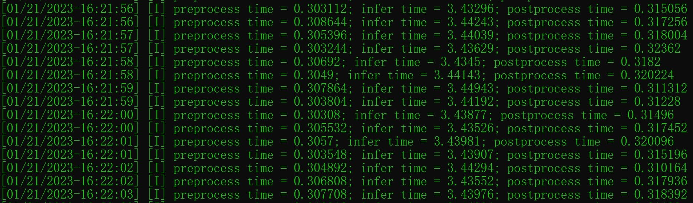
<br>		<!--换行-->
<center>一个batch内，平均每一帧的时间开销	<!--标题--></center>
    <br>		<!--换行-->
</div>
<br>

## 严格的精度对齐，官方效果 vs TensorRT-Alpha:
<br>
<div align='center'>			<!--块级封装-->
     <center>	<!--将图片和文字居中-->
    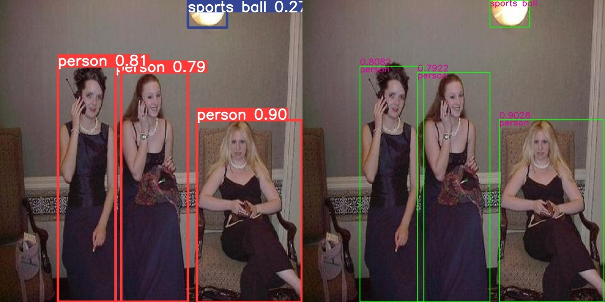
    <br>		<!--换行-->
    <center>yolov8n : Offical( left ) vs Ours( right )	<!--标题--></center>
    <br>		<!--换行-->
    <br>		<!--换行-->
    <center>	<!--将图片和文字居中-->
    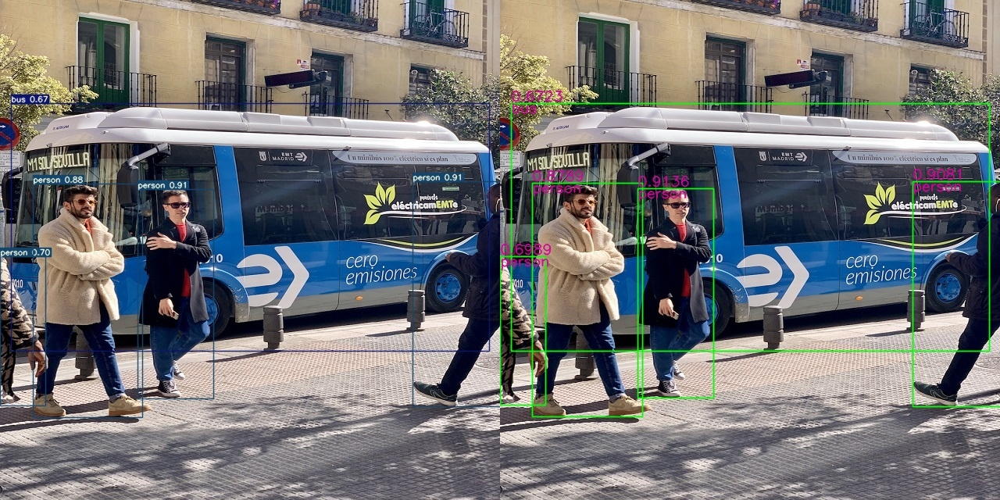
    <br>		<!--换行-->
    <center>yolov7-tiny : Offical( left ) vs Ours( right )	<!--标题--></center>
    <br>		<!--换行-->
    <br>		<!--换行-->
    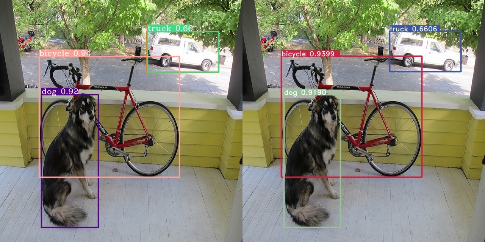
    <br>		<!--换行-->
    <center>yolov6s : Offical( left ) vs Ours( right )	<!--标题--></center>
    <br>		<!--换行-->
    <br>		<!--换行-->
    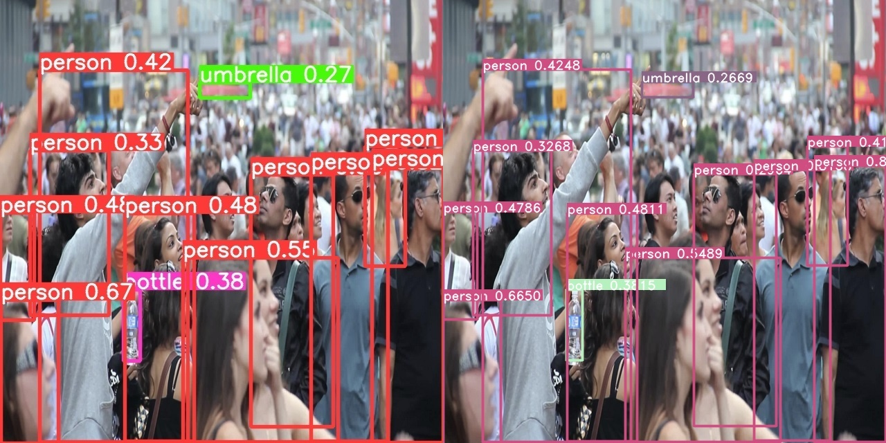
    <br>		<!--换行-->
    <center>yolov5s : Offical( left ) vs Ours( right )	<!--标题--></center>
    <br>		<!--换行-->
    <br>		<!--换行-->
    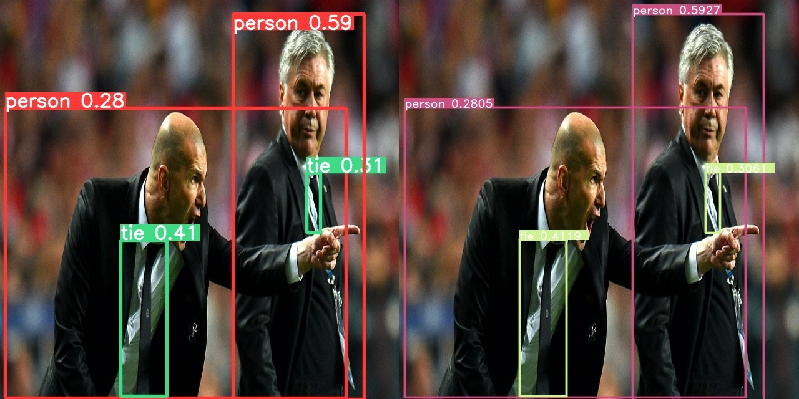
    <br>		<!--换行-->
    <center>yolov5s : Offical( left ) vs Ours( right )	<!--标题--></center>
    <br>		<!--换行-->
    <br>		<!--换行-->
    
    <br>		<!--换行-->
    <center>libfacedetection : Offical( left ) vs Ours( right topK:2000)	<!--标题--></center>
    <br>		<!--换行-->
    <br>		<!--换行-->
    </center>
</div>


## Citation
```bash
@misc{FeiYull_TensorRT-Alpha,  
  author = {FeiYull},  
  title = {TensorRT-Alpha},  
  year = {2023},  
  publisher = {GitHub},  
  journal = {GitHub repository},  
  howpublished = {https://github.com/FeiYull/tensorrt-alpha}
}
```