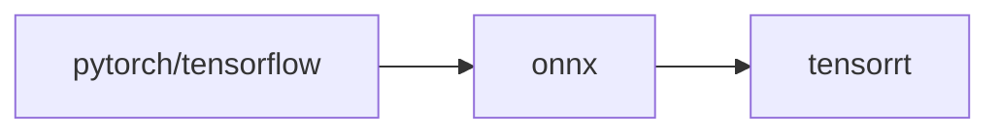

# TensorRT-Alpha
<div align="center">

  [English](README.md) | 简体中文
  <br>
  </div>

## 介绍
本仓库提供深度学习CV领域模型加速部署案例，主流模型前处理、后处理提供cuda加速方法。大部分模型转换流程为：torch->onnx->tensorrt。获取onnx文件以下有两种方式：

- 本仓库提供的网盘直接下载onnx；
- 按照本仓库提供的指令，手动从相关源代码框架导出onnx。



## 更新
- 2023.01.01  🔥 更新 yolov3, yolov4, yolov5, yolov6
- 2023.01.04  🍅 更新 yolov7, yolox, yolor
- 2023.01.05  🎉 更新 u2net, libfacedetction
- 2023.01.08  🚀 全网最快支持yolov8的tensorrt部署

## 安装
适用平台: windows and linux. 以下环境已经被测试过：<br>
### ubuntu18.04
- cuda11.3
- cudnn8.2.0
- gcc7.5.0
- tensorrt8.4.2.4
- opencv3.x、4.x
- cmake3.10.2

### windows10
- cuda11.3
- cudnn8.2.0
- visual studio 2017 and 2019
- tensorrt8.4.2.4
- opencv3.x、4.x

python环境（可选）：
```bash
# 需要安装miniconda
conda create -n tensorrt-alpha python==3.8 -y
conda activate tensorrt-alpha
git clone https://github.com/FeiYull/tensorrt-alpha
cd tensorrt-alpha
pip install -r requirements.txt  # 安装
```
## 快速开始
### ubuntu18.04
设置TensorRT根目录（安装目录）路径:
```bash
git clone https://github.com/FeiYull/tensorrt-alpha
cd tensorrt-alpha/cmake
vim common.cmake
# 把common.cmake文件第20行中的TensorRT_ROOT修改成您的TensorRT安装目录, 例如改成如下:
# set(TensorRT_ROOT /root/TensorRT-8.4.2.4)
```
开始编译、运行工程，例如:[yolov7](yolov7/README.md)

### windows10
waiting for update

## 模型
目前已实现30多个主流模型，部分整理好的onnx文件如下列表：
<div align='center'>

| model |weiyun |google driver |
 :-: | :-: | :-: |
|[yolov3](yolov3/README.md)| [weiyun](https://share.weiyun.com/3T3mZKBm)| [google driver](https://drive.google.com/drive/folders/1-8phZHkx_Z274UVqgw6Ma-6u5AKmqCOv?usp=sharing)|      
|[yolov4](yolov4/README.md)| [weiyun](https://share.weiyun.com/3T3mZKBm)| [google driver](https://drive.google.com/drive/folders/1-8phZHkx_Z274UVqgw6Ma-6u5AKmqCOv?usp=sharing)|
|[yolov5](yolov5/README.md)| [weiyun](https://share.weiyun.com/3T3mZKBm)| [google driver](https://drive.google.com/drive/folders/1-8phZHkx_Z274UVqgw6Ma-6u5AKmqCOv?usp=sharing)|     
|[yolov6](yolov6/README.md)| [weiyun](https://share.weiyun.com/3T3mZKBm)| [google driver](https://drive.google.com/drive/folders/1-8phZHkx_Z274UVqgw6Ma-6u5AKmqCOv?usp=sharing)|     
|[yolov7](yolov7/README.md)| [weiyun](https://share.weiyun.com/3T3mZKBm)| [google driver](https://drive.google.com/drive/folders/1-8phZHkx_Z274UVqgw6Ma-6u5AKmqCOv?usp=sharing)|     
|[yolov8](yolov8/README.md)| [weiyun](https://share.weiyun.com/3T3mZKBm)| [google driver](https://drive.google.com/drive/folders/1-8phZHkx_Z274UVqgw6Ma-6u5AKmqCOv?usp=sharing)|     
|[yolox](yolox/README.md)| [weiyun](https://share.weiyun.com/3T3mZKBm)| [google driver](https://drive.google.com/drive/folders/1-8phZHkx_Z274UVqgw6Ma-6u5AKmqCOv?usp=sharing)|     
|[yolor](yolor/README.md)| [weiyun](https://share.weiyun.com/3T3mZKBm)| [google driver](https://drive.google.com/drive/folders/1-8phZHkx_Z274UVqgw6Ma-6u5AKmqCOv?usp=sharing)|     
|[u2net](u2net/README.md)| [weiyun](https://share.weiyun.com/3T3mZKBm)| [google driver](https://drive.google.com/drive/folders/1-8phZHkx_Z274UVqgw6Ma-6u5AKmqCOv?usp=sharing)|     
|[libfacedet](libfacedetection/README.md)| [weiyun](https://share.weiyun.com/3T3mZKBm)| [google driver](https://drive.google.com/drive/folders/1-8phZHkx_Z274UVqgw6Ma-6u5AKmqCOv?usp=sharing)|     
|[facemesh](facemesh/README.md)| [weiyun](https://share.weiyun.com/3T3mZKBm)| [google driver](https://drive.google.com/drive/folders/1-8phZHkx_Z274UVqgw6Ma-6u5AKmqCOv?usp=sharing)|     
|more...(🚀: I will be back soon!)    |      |          |
</div>  

## 可视化
<div align='center'>
  
  
  
  <br>
  
  
  
  <br>
</div>   

严格的精度对齐，官方效果 vs TensorRT-Alpha:<br>
<div align='center'>			<!--块级封装-->
     <center>	<!--将图片和文字居中-->
    
    <br>		<!--换行-->
    <center>yolov8n : Offical( left ) vs Ours( right )	<!--标题--></center>
    <br>		<!--换行-->
    <br>		<!--换行-->
    <center>	<!--将图片和文字居中-->
    
    <br>		<!--换行-->
    <center>yolov7-tiny : Offical( left ) vs Ours( right )	<!--标题--></center>
    <br>		<!--换行-->
    <br>		<!--换行-->
    
    <br>		<!--换行-->
    <center>yolov5s : Offical( left ) vs Ours( right )	<!--标题--></center>
    <br>		<!--换行-->
    <br>		<!--换行-->
    
    <br>		<!--换行-->
    <center>libfacedetction : Offical( left ) vs Ours( right topK:4000)	<!--标题--></center>
    <br>		<!--换行-->
    <br>		<!--换行-->
    </center>
</div>

## 参考
[0].https://github.com/NVIDIA/TensorRT<br>
[1].https://github.com/onnx/onnx-tensorrt<br>
[2].https://github.com/NVIDIA-AI-IOT/torch2trt<br>
[3].https://github.com/shouxieai/tensorRT_Pro<br>
[4].https://github.com/opencv/opencv_zoo<br>
